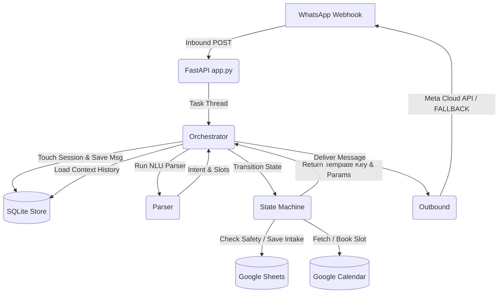

# Project Summary & Handoff Reference: PhysioBot

PhysioBot is a deterministic, state-machine-driven WhatsApp chatbot for **Balance Plus Physiotherapy Clinic (HSR Layout, Sector 7, Bengaluru)**. Its primary goal is to guide patients through intake questions, screen for red flags, recommend services, check calendar slots, and confirm appointments.

The chatbot is designed to be **grandma-friendly** (simple selections, low cognitive load, interactive buttons/lists) and **highly robust** (on-rails deterministic state machine, no LLM hallucinations).

---

## 🏗️ Architecture Overview

The codebase is structured as a pipeline of independent modules:



### 1. File Structure
* **`physiobot/app.py`**: The FastAPI entrypoint exposing `/webhook` (Meta Cloud API integration), `/simulate` (local CLI/curl testing), and `/healthz`.
* **`physiobot/webhook.py`**: Webhook signature verification (`X-Hub-Signature-256`) and inbound payload parsing — extracts text, the underlying `interactive_id` for button/list replies (not just its display title), and the sender's WhatsApp profile name when Meta includes it.
* **`physiobot/store.py`**: SQLite database interface (`physiobot.db`) for storing persistent message history and session states. Schema is re-created defensively on every connection (see Key Learning #4).
* **`physiobot/parser.py`**: The Natural Language Understanding (NLU) layer. Uses the configured LLM (local Ollama or Groq, via `llm.py`) to parse user inputs into structured JSON (intent, slots, red flags). Features a **regex fallback parser**, gated by `detect_expected_slot()`, to keep the bot operational if the LLM fails.
* **`physiobot/llm.py`**: Thin provider abstraction (`OllamaProvider` / `GroqProvider`) — `chat(messages) -> {"role": "assistant", "content": str}`. No tool-calling support; the parser only ever needs one JSON-text reply.
* **`physiobot/state_machine.py`**: The deterministic dialogue manager. Controls intake progress, schedules calendar appointments, appends bookings to sheets, and returns output templates. Button/list replies are assigned directly to whichever slot is currently expected (`_current_expected_slot`) instead of being re-parsed by NLU.
* **`physiobot/clinic_kb.py`**: Typed accessor (`ClinicKB`) over `clinic_metadata.json` — the single place that knows the current metadata schema (clinic name/phone, red flags, canned FAQ copy, service-recommendation matching). A future metadata schema migration should only require changes here.
* **`physiobot/metadata.py`**: Raw JSON loader for `clinic_metadata.json`, with a startup warning if an expected top-level key is missing (catches schema drift early).
* **`physiobot/templates.py`**: Registry of WhatsApp Cloud API messages, converting state machine keys into native WhatsApp template payloads (standard text templates or interactive buttons/lists).
* **`physiobot/outbound.py`**: Outbound Meta Graph API sender. Sends native interactive list menus and buttons when configured, falling back to standard text logs in local development.
* **`physiobot/tools/`**: Interfaces for Google Calendar (`calendar.py`) and Google Sheets (`sheets.py`).
* **`physiobot/clinic_metadata.json`**: Real-world knowledge base for the clinic (schema v3.0.0+ — services, branch/contact info, canned customer-facing copy, service-recommendation rules, red flags, fields still pending clinic confirmation).

---

## ⚙️ Dialogue State Machine & Intake Slots

The conversation progresses sequentially through intake slots. The state machine operates in three primary phases:

| Phase / State | Trigger / Logic | Next Step / Response |
| :--- | :--- | :--- |
| **`START`** | Greeting message from user. | Clears old session, welcomes user, transitions to `COLLECTING_INTAKE`. |
| **`COLLECTING_INTAKE`** | Sequentially validates and prompts for missing slots: name confirmation → consent → complaint → pain details → service mode → branch. | Once name, phone, and complaint are filled, writes to **Patients** Google Sheet. Branch is asked explicitly (never assumed); returning patients get a one-tap "same branch as last time?". Prompts for the next missing slot. |
| **`AWAITING_SLOT_SELECTION`** | Intake complete (HSR branch). Collects date, fetches free slots from Calendar, prompts slots, confirms booking on slot selection. | Writes confirmation row to **Bookings** Google Sheet (incl. `BranchId`) + schedules Calendar Event. Confirmation includes address + contact. Transitions to `CONFIRMED`. |
| **`CONFIRMED`** | Appointment booked. An explicit new-booking request resets the session; a bare "hi"/"thank you" is answered warmly without wiping the booking. | Reaffirms the existing appointment (`post_booking_chat`); FAQs still answered inline. |
| **`HUMAN_HANDOFF`** | Triggered by red flags, cancellations, payments, insurance queries, report uploads, declined consent, or a non-HSR branch choice. | Shares coordinator/branch contact info. Not a permanent dead end: a red-flag handoff resumes intake once the urgent symptom isn't restated (see Key Learning #11). Price/hours/home-visit/therapist questions are *not* handoffs — answered inline and the conversation continues. `ask_location` additionally returns a tappable Google Maps link (`location_with_map` / `cta_url` — see Key Learning #7). |

### Intake Slots
1. `phone_number`: Always taken from the WhatsApp sender id — never asked as free text, and the NLU layer can never overwrite it.
2. `full_name`: Offered for one-tap confirmation when WhatsApp provides a profile name (`confirm_details` → `details_confirmed`), otherwise asked directly (`request_full_name`).
3. `consent_given`: Required before any symptom details are collected (privacy/consent gate).
4. `main_problem`: Description of symptoms/complaint. Matched against `clinic_metadata.json`'s service-recommendation rules to surface a relevant service suggestion.
5. `pain_area`: Normalized location of discomfort (e.g., knee, lower back).
6. `pain_duration`: How long the issue has persisted.
7. `pain_score`: Mild/Moderate/Severe bucket, stored as a representative 0-10 value (3/6/9) for the sheet.
8. `preferred_service_mode`: `clinic_visit` \| `home_visit` \| `tele_consultation`.
9. `preferred_branch`: Which branch the patient is booking. Asked explicitly (never assumed); returning patients are offered their last-visited branch for one-tap reuse. Only the primary (HSR Layout) branch has live calendar access — others route to a human handoff.
10. `preferred_date`: Solved target date (YYYY-MM-DD).
11. `preferred_time`: Target slot start time (HH:MM).

Button/list replies (consent, pain area/duration/score, service mode, branch/returning-branch, time slot, details confirmation) are never re-parsed by NLU — `state_machine._current_expected_slot()` assigns the WhatsApp option id directly to whichever slot is currently expected.

---

## 👵 Grandma-Friendly WhatsApp UI

To make the bot accessible to elderly users and avoid typos/hallucinations, free-form text input is minimized in favor of **native WhatsApp Interactive messages**:

* **Lists (up to 10 options):** Used for **Pain Area**, **Pain Duration**, **Pain Score (grouped into Mild/Moderate/Severe sections)**, and **Free Slot Time Selection**.
* **Quick-Reply Buttons (up to 3 options):** Used for **Service Mode Selection** (Clinic, Home, Online) and **Yes/No Slots** (Doctor referrals, reports availability).
* **Metadata Exemption:** Native WhatsApp button/list replies (`type: interactive`) do **not** require Meta template registration/approval and work immediately in the 24h conversational window.

---

## 💡 Key Learnings & Engineering Discoveries

### 1. Contextual Slot Spillover (The "Hallucination" Bug)
* **Problem:** In earlier versions, starting a new booking flow caused the bot to immediately confirm an appointment for today at 2:15 PM without asking.
* **Root Cause:** When the user said `"Hi, I want to book"` to start a new chat, the NLU parser fetched the last 20 messages of history. The LLM parsed the historical messages (from the *previous* session, containing `"2:15"` and `"today"`) and populated the active slots of the *new* session, triggering an immediate booking confirmation.
* **Resolution:** 
  1. The bot now **purges the SQLite message database history** for that phone number the moment a new booking session is initialized.
  2. Implemented a **4-hour session inactivity timeout**. If the patient returns after 4 hours, their old slots and message history are automatically wiped.
  3. Added explicit `"restart"` and `"start over"` keyword listeners to reset the session manually.

### 2. Regex Fallback NLU
* **Problem:** Local Ollama models (`qwen2.5`) occasionally timeout or return blank outputs under memory pressure.
* **Resolution:** The exception handler in `parser.py` implements a robust regex-based keyword matching parser. If the LLM fails, the bot uses regex rules to classify intents (greeting, book, cancel, reschedule, price, etc.) and extract slots (phone numbers, pain scores, service modes, locations), keeping the conversation alive.

### 3. Outbound Message Pipeline
* **Problem:** Interactive message payloads are parsed differently by Meta webhook.
* **Resolution:** `webhook.py` parses `msg_type == "interactive"` by extracting the selected option's `title` (for display/history) **and** its `id` separately, and feeds both back to the pipeline.

### 4. Button/List Replies Must Bypass NLU Entirely
* **Problem:** Even with the option's `title` fed back as plain text, the LLM/regex parser had no idea which question was actually being answered. A duration reply like `"1-3 days"` could be misread as a pain score, or a date could get "assumed" without ever being asked — the bot would then confidently announce no slots were available for a date the patient never gave.
* **Resolution:** `orchestrator.py` skips the NLU parser entirely when an inbound message carries an `interactive_id`. `state_machine._current_expected_slot()` deterministically figures out which slot the bot is currently waiting on (mirroring the same sequential intake order used to decide what to ask next) and assigns the option id directly — zero ambiguity, no LLM guess involved.

### 5. DB Self-Healing — Never Trust a Singleton's Cached Schema
* **Problem:** `StateMachine` and `Store` are long-lived singletons (constructed once in `app.py`) that created their SQLite schema only at `__init__`. Deleting/replacing `physiobot.db` while the process was alive (e.g. an ops cleanup) left the schema gone — the next query crashed with "no such table", and because `orchestrator.handle_message`'s first DB calls were outside its try/except, the exception died silently inside a FastAPI `BackgroundTask`. The bot just stopped replying, with no error visible anywhere.
* **Resolution:** Both classes now re-run their (idempotent) `CREATE TABLE IF NOT EXISTS` schema on every connection, not just once at construction. `orchestrator.handle_message` wraps the *entire* turn — including the initial DB writes — so any unexpected failure anywhere still results in a fallback message being sent, never silence.

### 6. Metadata Schema Migrations Need a Facade, Not Scattered `.get()` Chains
* **Problem:** `clinic_metadata.json` went through a breaking schema rewrite (v2.0.0 → v3.0.0 — every top-level key renamed, `faq_for_bot` removed entirely). Code that read the metadata directly via chains like `self.metadata.get("hsr_branch", {}).get("contact", {}).get("primary_phone")` didn't error on the rename — it just silently returned `{}`/`None`, degrading red-flag detection, FAQ answers and service hints to nothing.
* **Resolution:** `clinic_kb.py`'s `ClinicKB` class is now the single place that interprets the metadata schema (`clinic_name`, `clinic_phone`, `red_flag_triggers`, `response_template(key)`, `match_service(complaint)`). `metadata.py` also logs a loud warning at load time if an expected top-level key is missing. A future schema migration should only require changes in one file instead of three.

### 7. Tappable Maps Link Without a Maps API Key
* **Problem:** The clinic address is now in `clinic_metadata.json`, and a tappable map link is far more useful to a patient than a printed address string — but the Geocoding/Static Maps APIs require enabling billing on a GCP project for what the metadata already gives us as plain, public text.
* **Resolution:** `ClinicKB.maps_url` builds a Google Maps deep link (`https://www.google.com/maps/search/?api=1&query=<address>`) directly from the official address text — no API key or GCP billing needed. It opens Maps as a text search rather than a precisely geocoded pin, which is an acceptable trade-off since the metadata itself marks the exact address as not yet clinic-verified. `ask_location` returns the new `location_with_map` template, which `templates.py` renders as a native WhatsApp `cta_url` interactive message (one tappable button) instead of plain text, with a graceful plain-text-with-link fallback when Meta isn't configured.

### 8. Meta's 10-Row Cap on Interactive Lists Is a Hard Rejection, Not a Warning
* **Problem:** `request_pain_area` (13 rows across 2 sections) and `request_pain_score` (originally an 11-row 0-10 scale) both exceeded Meta's hard limit of **10 total rows across all sections combined** in a single WhatsApp list message. Meta rejects the send outright (`"Total row count exceed max allowed count: 10"`), and because that failure happens *after* the state machine already advanced/saved session state, the conversation just goes silent — no visible error to the patient.
* **Resolution:** Trimmed `request_pain_area` to 10 rows (post-surgery/sports-injury context is already captured via the free-text complaint and matched in `service_recommendation_logic`, so dropping those rows loses no signal; wrist+hand merged into one row). Replaced the 0-10 `request_pain_score` scale with 3 plain-language buckets (Mild/Moderate/Severe → 3/6/9), which is also more grandma-friendly than asking for numeric precision over chat. `tests/test_templates.py` now guards every list/button template against Meta's row/section/button caps so this can't silently regress.

### 9. Slot-Merge Must Be Gated by Conversation Phase, Not Just by Slot Name
* **Problem:** The NLU parser's extracted slots were merged into the session unconditionally on every turn (aside from `phone_number`). An LLM can "helpfully" fill in a `preferred_date` (e.g. defaulting to tomorrow) on a turn where the patient never mentioned a date at all — the bot then skipped straight to showing slots for a day nobody asked for, and an explicit free-text request to change the date afterward was silently dropped by the regex fallback (which had no date-parsing logic whatsoever), making the bot look like it was "resisting" the change.
* **Resolution:** `preferred_date`/`preferred_time` are now only merged into the session while `status == "AWAITING_SLOT_SELECTION"` — the one phase where asking about dates is actually valid — so a premature LLM guess during intake is discarded rather than silently booked against. `parser.py` gained `parse_natural_date`/`parse_natural_time`, regex-based resolvers (ISO dates, "today"/"tomorrow", weekday names, "23rd June"/"June 23") that activate only when the bot's last message was actually asking about a date or time slot, giving the fallback parser the same date-handling robustness as the LLM path — so changing the date works the same regardless of which NLU backend is live.

### 10. Branch Confirmation + Returning-Patient Memory (Never Assume HSR)
* **Problem:** The bot silently assumed every booking was for the HSR Layout branch, even though the clinic has four (HSR, Koramangala, Domlur, Brookefield). It also had no memory of where a returning patient went last time. And only the HSR branch has a live Google Calendar/Sheet, so the bot has no way to actually check availability elsewhere.
* **Resolution:** After intake, the bot now asks which branch explicitly. A returning patient (looked up by phone via `SheetsClient.last_branch_for_phone`, backed by a new `BranchId` column on the Bookings sheet) gets a one-tap "book the same branch as last time?" instead. `ClinicKB.branches()`/`branch_by_id()`/`Branch.short_name` read the metadata's `primary_branch` + `other_branches_reference`. Picking any non-HSR branch routes to `non_hsr_branch_handoff` (a human confirms the slot) rather than the bot fabricating availability it can't see. `Branch.short_name` strips the redundant "Balance Plus - " prefix so row titles fit Meta's 24-char list-row cap (error 131009 "Row title is too long"); the dynamic `request_branch`/`show_slots` row builders also defensively truncate titles/descriptions, since only the static-template path did before.

### 11. Red Flags Must Be Scoped to the Current Message, and Aren't a Dead End
* **Problem:** The LLM parser was told to detect red flags across "the user's latest input and the chat history", so it kept re-surfacing an earlier urgent symptom (e.g. chest pain) on every subsequent turn. A patient who said "chest and lower back pain", got the (correct) urgent-care alert, then asked "can you help with my lower back pain?" just got the same alert again — even though lower back pain is exactly what the clinic treats.
* **Resolution:** The parser prompt now scopes `red_flags_detected` to the **most recent user message only** (the regex fallback already did this), with an explicit instruction not to re-report historical red flags. The state machine records a `red_flag_handoff` flag when it alerts; on a later turn that carries no red flag, it resumes intake (`resumed_after_red_flag`) and prepends a one-time reminder that the urgent symptom still needs separate medical attention — so the bot helps with what it can while respectfully staying in its lane. A literal-substring cross-check was deliberately *avoided* here: the LLM normalizes symptoms to canonical keywords (e.g. "my chest hurts" → "chest pain"), so substring-matching the message would risk discarding a genuine red flag — an unacceptable false negative on safety.

---

## 🛠️ Local Testing & Dev Guide

### 1. Running the server
Activate the virtual environment and launch uvicorn:
```bash
source .venv/bin/activate
uvicorn physiobot.app:app --reload
```

### 2. Simulating input locally (No WhatsApp required)
Send POST requests to `/simulate` to interact with the state machine:
```bash
curl -X POST http://localhost:8000/simulate \
  -H "Content-Type: application/json" \
  -d '{"text": "Hi, I have lower back pain"}'
```

### 3. Running tests
Verify all system components using pytest:
```bash
pytest
```
* Test configuration is declared in `tests/conftest.py`.
* SQLite and Sheets integrations are fully stubbed/mocked inside tests.
