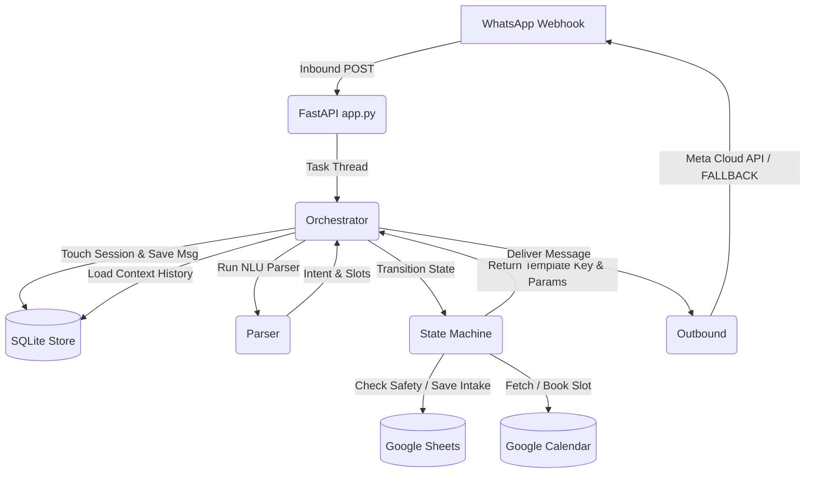

# Project Summary & Handoff Reference: PhysioBot

PhysioBot is a deterministic, state-machine-driven WhatsApp chatbot for **Balance Plus Physiotherapy Clinic (HSR Layout, Sector 7, Bengaluru)**. Its primary goal is to guide patients through intake questions, screen for red flags, recommend services, check calendar slots, and confirm appointments.

The chatbot is designed to be **grandma-friendly** (simple selections, low cognitive load, interactive buttons/lists) and **highly robust** (on-rails deterministic state machine, no LLM hallucinations).

---

## 🏗️ Architecture Overview

The codebase is structured as a pipeline of independent modules:



### 1. File Structure
* **`physiobot/app.py`**: The FastAPI entrypoint exposing `/webhook` (Meta Cloud API integration), `/simulate` (local CLI/curl testing), and `/healthz`.
* **`physiobot/webhook.py`**: Webhook signature verification (`X-Hub-Signature-256`) and inbound payload parsing (handling both text and WhatsApp `button_reply` / `list_reply` messages).
* **`physiobot/store.py`**: SQLite database interface (`physiobot.db`) for storing persistent message history and session states.
* **`physiobot/parser.py`**: The Natural Language Understanding (NLU) layer. Uses the configured LLM (local Ollama or Groq) to parse user inputs into structured JSON (intent, slots, red flags). Features a **regex fallback parser** to keep the bot operational if the LLM fails.
* **`physiobot/state_machine.py`**: The deterministic dialogue manager. Controls intake progress, schedules calendar appointments, appends bookings to sheets, and returns output templates.
* **`physiobot/templates.py`**: Registry of WhatsApp Cloud API messages, converting state machine keys into native WhatsApp template payloads (standard text templates or interactive buttons/lists).
* **`physiobot/outbound.py`**: Outbound Meta Graph API sender. Sends native interactive list menus and buttons when configured, falling back to standard text logs in local development.
* **`physiobot/tools/`**: Interfaces for Google Calendar (`calendar.py`) and Google Sheets (`sheets.py`).
* **`physiobot/clinic_metadata.json`**: Real-world knowledge base for the clinic (services, addresses, FAQs, contact info, and medical safety red flags).

---

## ⚙️ Dialogue State Machine & Intake Slots

The conversation progresses sequentially through intake slots. The state machine operates in three primary phases:

| Phase / State | Trigger / Logic | Next Step / Response |
| :--- | :--- | :--- |
| **`START`** | Greeting message from user. | Clears old session, welcomes user, transitions to `COLLECTING_INTAKE`. |
| **`COLLECTING_INTAKE`** | Sequentially validates and prompts for missing slots. | Once name, phone, and complaint are filled, writes to **Patients** Google Sheet. Prompts for the next missing slot. |
| **`AWAITING_SLOT_SELECTION`** | Intake complete. Collects date, fetches free slots from Calendar, prompts slots, confirms booking on slot selection. | Writes confirmation row to **Bookings** Google Sheet + schedules Calendar Event. Transitions to `CONFIRMED`. |
| **`CONFIRMED`** | Appointment booked. Greet intent resets the session. | Fallback text redirecting to manual clinic lines. |
| **`HUMAN_HANDOFF`** | Triggered by red flags, cancellations, payments, scans/reports, or human-request intents. | Disables bot responses and shares coordinator contact info. |

### Intake Slots
1. `full_name`: Patient's first and last name.
2. `phone_number`: Patient's primary phone number.
3. `main_problem`: Description of symptoms/complaint.
4. `pain_area`: Normalized location of discomfort (e.g., knee, lower back).
5. `pain_duration`: How long the issue has persisted.
6. `pain_score`: Pain scale rating (0 to 10).
7. `preferred_service_mode`: `clinic_visit` \| `home_visit` \| `tele_consultation`.
8. `preferred_date`: Solved target date (YYYY-MM-DD).
9. `preferred_time`: Target slot start time (HH:MM).

---

## 👵 Grandma-Friendly WhatsApp UI

To make the bot accessible to elderly users and avoid typos/hallucinations, free-form text input is minimized in favor of **native WhatsApp Interactive messages**:

* **Lists (up to 10 options):** Used for **Pain Area**, **Pain Duration**, **Pain Score (grouped into Mild/Moderate/Severe sections)**, and **Free Slot Time Selection**.
* **Quick-Reply Buttons (up to 3 options):** Used for **Service Mode Selection** (Clinic, Home, Online) and **Yes/No Slots** (Doctor referrals, reports availability).
* **Metadata Exemption:** Native WhatsApp button/list replies (`type: interactive`) do **not** require Meta template registration/approval and work immediately in the 24h conversational window.

---

## 💡 Key Learnings & Engineering Discoveries

### 1. Contextual Slot Spillover (The "Hallucination" Bug)
* **Problem:** In earlier versions, starting a new booking flow caused the bot to immediately confirm an appointment for today at 2:15 PM without asking.
* **Root Cause:** When the user said `"Hi, I want to book"` to start a new chat, the NLU parser fetched the last 20 messages of history. The LLM parsed the historical messages (from the *previous* session, containing `"2:15"` and `"today"`) and populated the active slots of the *new* session, triggering an immediate booking confirmation.
* **Resolution:** 
  1. The bot now **purges the SQLite message database history** for that phone number the moment a new booking session is initialized.
  2. Implemented a **4-hour session inactivity timeout**. If the patient returns after 4 hours, their old slots and message history are automatically wiped.
  3. Added explicit `"restart"` and `"start over"` keyword listeners to reset the session manually.

### 2. Regex Fallback NLU
* **Problem:** Local Ollama models (`qwen2.5`) occasionally timeout or return blank outputs under memory pressure.
* **Resolution:** The exception handler in `parser.py` implements a robust regex-based keyword matching parser. If the LLM fails, the bot uses regex rules to classify intents (greeting, book, cancel, reschedule, price, etc.) and extract slots (phone numbers, pain scores, service modes, locations), keeping the conversation alive.

### 3. Outbound Message Pipeline
* **Problem:** Interactive message payloads are parsed differently by Meta webhook.
* **Resolution:** `webhook.py` parses `msg_type == "interactive"` by extracting the selected option's `title` (or fallback to its `id`) from either `button_reply` or `list_reply` and feeds it back to the pipeline as a normal user text turn.

---

## 🛠️ Local Testing & Dev Guide

### 1. Running the server
Activate the virtual environment and launch uvicorn:
```bash
source .venv/bin/activate
uvicorn physiobot.app:app --reload
```

### 2. Simulating input locally (No WhatsApp required)
Send POST requests to `/simulate` to interact with the state machine:
```bash
curl -X POST http://localhost:8000/simulate \
  -H "Content-Type: application/json" \
  -d '{"text": "Hi, I have lower back pain"}'
```

### 3. Running tests
Verify all system components using pytest:
```bash
pytest
```
* Test configuration is declared in `tests/conftest.py`.
* SQLite and Sheets integrations are fully stubbed/mocked inside tests.
